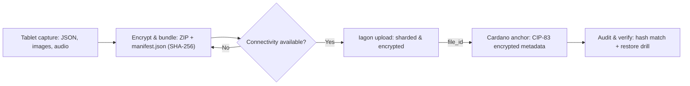

# Haiti Telemedicine — Blockchain MVP
**Encrypted off-chain storage (Iagon) + on-chain integrity anchors (Cardano / CIP-83).**  
**Key rule:** *No PHI (personally identifiable health data) ever goes on-chain.*

This project integrates with the Midnight Network.

## Midnight Preprod Status

This repository is not yet running against Midnight Preprod.

Current status:
- Midnight integration is planned but not yet implemented in the current public MVP.
- The present repository remains Cardano + Iagon based.
- No `testnet-02` configuration is used in this repository.

Blocker:
- Preprod migration depends on required technical support/guidance for Midnight integration.

Next step:
- Once Preprod integration is available, this README will be updated with exact Preprod configuration and usage steps.

---

## Background

Haiti continues to face some of the most severe health disparities in the Western Hemisphere. Rural communities are especially affected due to a combination of systemic challenges: a critical shortage of healthcare professionals (with more than **85% of Haitian medical graduates emigrating**), fragile infrastructure, and limited access to consistent medical services.

The problem is not only medical—it is also infrastructural and social. Persistent poverty, low health literacy, and a deep digital divide constrain access to innovation and care. Current conditions include:
- **60% of Haitians live below $3.65/day** (World Bank, 2023)
- **>40% of youth (15–24) are neither in school, training, nor employment** (UNDP)
- **<2% of schools have functional computer labs** and **rural internet access is <10%** (IHSI)

In response, the **Haitian Resource Development Foundation (HRDF)**—a 501(c)(3) nonprofit established in 1987—launched a telemedicine initiative in **Aquin**, a rural commune in Haiti’s southern peninsula. The pilot began on **May 19, 2025**, and operates across **five healthcare sites**: the Aquin Community Hospital (hub) and four rural satellite clinics. Phase I includes deployment of **Starlink internet**, **solar energy**, and computers, alongside training for frontline staff.

A key differentiator of the initiative is that it is **people-first**, not technology-first. Telemedicine is treated as a tool for dignity and equitable care, and is paired with an intentional sociological research-action approach that studies trust, cultural adaptation, and adoption dynamics.

### Research-driven design

At the center of the initiative is a guiding research question:

> **How do rural populations transition from traditional and empirical medicine to trusting and adopting modern telehealth technologies?**

The project follows an **action research** approach inspired by Kurt Lewin’s iterative cycle (observe → plan → act → evaluate), ensuring the model stays responsive to real community perceptions and barriers as adoption evolves.

### FIU collaboration

**Florida International University (FIU)**—the **fifth-largest university in the United States**—is collaborating on the academic and research components, including support from the **Robert Stempel College of Public Health & Social Work**. The collaboration focuses on sociological research design, ethical alignment (including IRB pathways where applicable), and co-authoring a scientific publication documenting rural health transitions and outcomes. The **State University of Haiti** contributes local academic support in survey design, cultural alignment, and field methodology.

### Why a blockchain MVP here

In low-connectivity environments, maintaining **privacy**, **data integrity**, and **trust** across clinics, institutions, and donors is difficult. This repository focuses on a practical building block: a privacy-preserving pipeline that keeps health data off-chain while still providing tamper-evident verification for audits, research traceability, and institutional accountability.

---

## 1) What this is 

In clinics with spotty internet, staff still need to collect visit data, keep it private, and prove later that nothing was altered.

This MVP lets teams:
- **Work offline** on tablets/phones.
- **Encrypt and store** visit bundles safely in **Iagon**’s decentralized network.
- **Stamp a tiny, private receipt** on the **Cardano** blockchain (an “anchor”) so anyone can verify the data wasn’t tampered with—without seeing private details.

**Why it matters:** Patients keep their privacy. Clinics get an audit trail. Donors and institutions get verifiable integrity.

---

## 2) Who this is for

- **Clinicians & coordinators** – a simple, step-by-step routine (capture → encrypt → upload → anchor).
- **IT/engineers** – scripts, APIs, and wallet tooling to automate the pipeline.
- **Partners & sponsors** – privacy-first architecture with verifiable integrity.

---

## 3) Key principles

- **Privacy first**: PHI stays off-chain. Only anonymous IDs, hashes, sizes, timestamps are anchored.
- **Offline-first**: everything works without internet; syncs when possible.
- **Tamper-evident**: each record’s cryptographic **hash** is anchored on Cardano.
- **Simplicity**: small scripts + a one-page SOP for field use.

---
## 4) How it works (at a glance)

---

## 5) Proposed ecosystem stack

As the Haiti Telemedicine architecture evolves, the broader stack is shaping up around several complementary components:

- **iTERVE** – intended support for palm-based capture of patient vital signs in rural care settings
- **OnDoctor365** – telemedicine interface and clinical workflow expertise layer
- **GameChanger Wallet** – exploratory Cardano-side interaction path for hashing, transaction orchestration, and verifiable integrity workflows
- **Iagon** – decentralized encrypted off-chain storage for medical records and associated files
- **Midnight** – privacy, identity, consent, and access-control layer for sensitive patient data

### Current status
This reflects the proposed target architecture, not a fully implemented production stack.
Some integration details are still being defined, including:
- how iTERVE fits into the broader patient-data workflow
- how records move across capture, hashing, storage, and access-control layers
- how Iagon and Midnight will interoperate within the final privacy-preserving architecture
- how OnDoctor365 interfaces operationally with field and clinical processes

### Next coordination milestone

A cross-team technical alignment meeting is being organized with the following participants and technical roles:
- **OnDoctor365** — telemedicine platform and clinical workflow integration
- **GameChanger** — Cardano-side transaction orchestration, hashing flows, and integrity workflow design
- **Haiti CS data collection and integration team** — field data collection, systems integration, and implementation coordination
- **iTERVE** — palm-based vital-sign capture and device/data integration
- **Iagon** — decentralized encrypted storage architecture, retrieval flows, and data persistence design
- **Midnight** — privacy, identity, consent, and access-control architecture

The goal of this session is to define:
- capture and intake responsibilities
- data handoff points between tools and teams
- integrity and verification workflow requirements
- storage and retrieval responsibilities
- privacy, identity, consent, and access-control requirements

This meeting is intended to inform the next architecture phase, including how the privacy-preserving identity, consent, access-control, and decentralized storage layers should be mapped into the broader system design.

### Design intent

The intended system direction is:

1. **Perform patient triage** and assess the immediate care context.
2. **Capture patient vitals and field data** through appropriate care interfaces and devices.
3. **Generate verifiable integrity artifacts** for auditability and record validation.
4. **Store encrypted records off-chain** using decentralized infrastructure.
5. **Apply privacy, identity, consent, and access control** around sensitive medical information.
6. **Enable telemedicine workflows** that remain practical in low-connectivity environments.

This direction remains aligned with the project’s core rule: **no PHI goes on-chain**.

## 6) Exploratory Cardano-side wallet path: GameChanger Wallet

**Status:** Exploratory / under evaluation

In addition to the current Cardano + Iagon architecture, this project is evaluating **GameChanger Wallet** as a possible **Cardano-side interaction layer** for QR-driven workflows, transaction orchestration, and hash-anchored record verification.

This does **not** change the project’s core privacy model:

- **No PHI goes on-chain**
- Medical records remain **off-chain**
- Cardano is used only for **integrity anchors**, verification, and auditability
- Any QR-based interaction is intended for **workflow access, portability, or verification**, not for exposing private medical data

### Why GameChanger is being evaluated

GameChanger’s public architecture and educational materials suggest a possible fit for this MVP because they emphasize:

- URL/JSON-based dApp and wallet interaction patterns
- QR-mediated user and device flows
- scripting and transaction orchestration
- hash-aware and file-related Cardano workflows

For this repository, that makes GameChanger relevant as a **potential operational layer** for initiating or simplifying Cardano-side integrity actions in low-connectivity healthcare environments.

### Important implementation note

At this stage, this repository does **not** claim:

- a production GameChanger integration
- a turnkey healthcare deployment
- a one-step “medical data hash from just a QR code” implementation

The current position is more conservative: **GameChanger appears to be a feasible component for future Cardano-side workflow design**, pending technical validation, compliance review, and implementation support.

### Reference

- GameChanger education brief: https://gc-education-one-pager.netlify.app/
